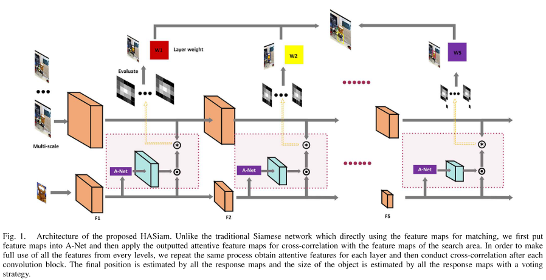

# weekly_paper
每周跟新、记录paper ## ## Table of Contents
- 模板 - [标题](https://github.com/bluoluo/weekly_paper/blob/master/README.md#标题) - Papers - [2019](https://github.com/bluoluo/weekly_paper/blob/master/README.md#2019) ## ## 标题
- **[paper简称]** paper题目 | **[标签(CVPR19等会议名称、paper类型tracking/detection)]** | [`[pdf]`](pdf链接) [`[code]`](code链接) * paper的笔记 ## 2019
- **[M2Det]** M2Det: A Single-Shot Object Detector based on Multi-Level Feature Pyramid Network | **[AAAI' 19]** |[`[pdf]`](https://arxiv.org/pdf/1811.04533.pdf) [`[official code - pytorch]`](https://github.com/qijiezhao/M2Det) ## # 15 8月2019日 ## Keypoint tracking ### SATIN Siamese Attentional Keypoint Network for High Performance Visual Tracking | [[`pdf`]](https://arxiv.org/abs/1904.10128) ✓ - **[Hourglass]** Stacked Hourglass Networks for Human Pose Estimation | [`[pdf]`](http://arxiv.org/abs/1603.06937) ✓ - **[MSPN]** Rethinking on Multi-Stage Networks for Human Pose Estimation | [`[pdf]`](https://arxiv.org/abs/1901.00148) - **[ArtTrack]** ArtTrack: Articulated Multi-person Tracking in the Wild Eldar | [`[pdf]`](http://arxiv.org/abs/1612.01465v3) - - **[CBAM]** CBAM: Convolutional Block Attention Module | [`[pdf]`](http://arxiv.org/abs/1807.06521) - **[SENet]** Squeeze-and-Excitation Networks |[`[pdf]`](http://arxiv.org/abs/1709.01507) - - **[CornerNet]** CornerNet: Detecting Objects as Paired Keypoints | [`[pdf]`](https://doi.org/10.1007/s11263-019-01204-1) - **[CenterNet]** CenterNet: Keypoint Triplets for Object Detection | [`[pdf]`](http://arxiv.org/abs/1904.08189) - **[CenterNet']** Objects as Points | [`[pdf]`](http://arxiv.org/abs/1904.07850) - ### LightTrack
LightTrack: A Generic Framework for Online Top-Down Human Pose Tracking | [`[pdf]`](https://arxiv.org/abs/1905.02822) ### ## Survey - Video Object Segmentation and Tracking: A Survey | [`[pdf]`](http://arxiv.org/abs/1904.09172)
- Object Detection and Tracking : A Survey | [`[pdf]`](http://ieeexplore.ieee.org/document/7546127/)
- Deep Learning in Video Multi-Object Tracking: A Survey | [`[pdf]`](http://arxiv.org/abs/1907.12740) # 5 9月2019日 ## attention - **[RASNet]** Learning Attentions: Residual Attentional Siamese Network for High Performance Online Visual Tracking - RASNet中注意模型的骨干是一个沙漏状卷积神经网络（cnn）模型[37]，
- **[SATN]** Siamese Attentional Keypoint Network for High Performance Visual Tracking - - **[MHA-Siam]** Multi-granularity Hierarchical Attention Siamese Network for Visual Tracking - IJCNN (C级会议)
- **[SA-Siam]** A Twofold Siamese Network for Real-Time Object Tracking - 两个孪生网络，语义特征、外观细节 异构，并不是以前那种简单直接的多层融合，两个相互独立分开训练
- **[FICFNet]** End-to-End Feature Integration for Correlation Filter Tracking With Channel Attention - IEEE SIGNAL PROCESSING LETTERS 3区期刊 - 在CFNet基础上设计了一个'Feature Integration'模块，然后运用end-to-end的训练思想，还有就是添加了通道注意力SENet；主干网络还是 AlexNet，也就简单/普通的融合conv2和conv5；
- **[TASNet]** Template Attentional Siamese Network for Object Tracking - 垃圾会议？还有一个中文期刊“结合注意力与特征融合的目标跟踪”内容一样的 - **[SiamVGG]** SiamVGG: Visual Tracking using Deeper Siamese Networks - 骨干网络换成VGG16。对于是否能换成跟深得网络简要的探讨，padding的影响；训练的方法和用了更大的数据集。 - **[SiamPF]** A Strong Feature Representation for Siamese Network Tracker - SA-Siam 和 SiamVGG 的结合体，应该说更像前者，改动之处使用了VGG16更深的网络；还有一点是 改进 APCE→APCEP 。 - 还说在VGG上面不适合用 通道注意力 模块？？半信半疑 - **[DensSiam]** DensSiam: End-to-End Densely-Siamese Network with Self-Attention Model for Object Tracking - 主干网络换成DenseNet，但是居然没有引用，[不懂?]；自注意力机制 ‘Self-Attention’ 这里讲的没太懂；还一直在强调 ’Non-local features‘ 提高网络泛化性！？，归功于Densely network 和Self-Attention？
- **[RAR]** Learning Reinforced Attentional Representation for End-to-End Visual Tracking - 增强注意力。帧间注意力+帧内注意力：帧间运用了LSTM这种机制，将跟踪问题表述为顺序推理任务；帧内又有通道和空间注意力（SENet/CBAM）。 - 整体而言还是CNN提取特征（’注意力‘增强特征效果），在运用DCF来进行判断,跟踪；骨干网络是Resnet50（略微改动），并分析了vgg和其他部分的效果（详细在消融实验部分）。整体而言还是比较复杂的，特别是在LSTM+那几个注意力模块。 - **[ ]** Learning Cascaded Siamese Networks for High Performance Visual Tracking - SiamFC + MDNet：两个方法结合(网络级联)，先相似性匹配，再从匹配中得分较高的部分缩放剪切(DSST)出一些候选区域，进而进行分类；针对其方法还提出了一种更新机制。 - 方法思路很清晰、简单——结合两个解决同一问题的不同方法！可能创新点不是太好，但是思想很巧妙。 - **[HASiam]** Hierarchical attentive Siamese network for real-time visual tracking - 通道/空间+非局部 注意力('spatial and channel-wise attentions' 'non-local attention module')，通道/空间注意力还分别放在网络的低中高层，进而融合更多层特征；‘非局部’ 有一点不是太明白？ - 主干网络还是Alexnet + VGG 两个分支，并没有用两个一样的、更深的VGG，分析还是因为padding的原因。 - 最后，作者也说网络对于更深的，或是更轻量级的网络试试。
- **[MFFSiam]** Deeper Siamese network with multi-level feature fusion for real-time visual tracking - 和上一篇是同一作者(南京信息工程大学)； - ”ELECTRONICS LETTERS“ 只是个SCI4区！就论文所呈现的结果来看，不止一个4区啊？！可能创新点不够？ - 骨干网络用的AlexNet，在后面几层的特征汇聚模块(feature agglomeration module)有所创新——上下两个分支采用了不一样的特征提取/融合策略（generalised non-local attention (GNLA) module and a inception-like module）；虽然都是前人的东西，但是结合后效果还是挺好的。 - 注意：剪切（crop-operation [11]），消除padding影响操作 - **[NL]** Non-local Neural Networks - 从感受野的方面入手，非局部/全局？（没看完） - **[]** Attention Is All You Need - （没看的）
- **[RACT]** Residual Attention Convolutional Network for Online Visual Tracking - 把 “Residual Attention” 残差注意力运用到跟踪上，是基于DCF的（这篇没细看完） - **[IMG-Siam]** Initial Matting-Guided Visual Tracking With Siamese Network - 在初始帧的模板中加入了分割策略(initial matting)，增强了初始帧模板的质量。 - 主干网络还是AlexNet，也添加了通道注意力。 ## backbone network - **[Attention-92]** Residual Attention Network for Image Classificatio - 设计了一种残差结构的注意力模块(基于ResNet)，模块可以嵌入到其他网络中。 - **[SKNet]** Selective Kernel Networks - "SENet" 的衍生，多了个选择性——对于不同的 感受野可以动态调节。

- **[HASiam]** Visual Object Tracking by Hierarchical Attention Siamese Network [IEEE TRANSACTIONS ON CYBERNETICS][SCI_1]
	- 
